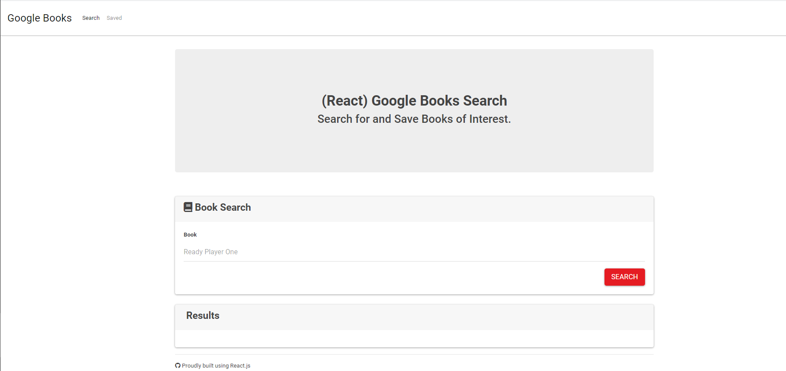
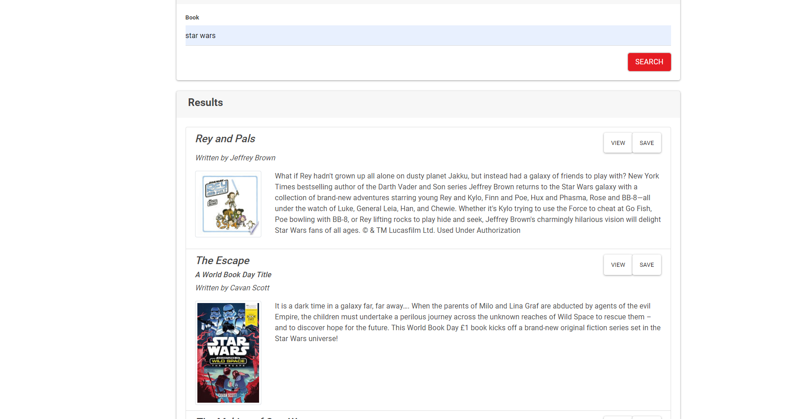
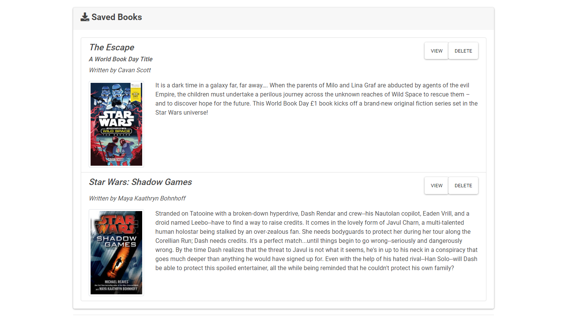

# react-google-books

## Goal:
Create a search engine to seach books on a topic using google books and to be able to save your choosen books.

## how it works:

1. On the hompage you have a serch box. when you anter the name of a topic you will be shown a list of books on the topic.
2. Each book will be show in a card that will include: title, subtitla author, description and an image of the cover. It will also have two buttons, one to the link of the book in google books. and one to save the book to your lis of books.
3. On the top of the page ther will be a ling to an other tab with all the saved books.
4. On the saved page tab it will display all the savad bokks in the same way they are presented in the home page but the savad button will be replace with a delete button.
5. Clicking on the saved button will delete the book from the saved list.

##Screenshots:

##Links:

GitHub Ripo:
https://github.com/zpinson/react-google-books
Deployed link:
https://zpgooglebooks.herokuapp.com/